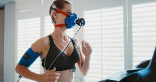

# Exercise Physiology: Communicating V̇O2 Data Using Markdown  
### A Structured Documentation Demonstration

## Visual Representation of V̇O2 Testing

<table>
<tr>
<td width="45%">

</td>
<td width="55%">

V̇O2 max testing measures maximal oxygen consumption during graded exercise.

This layout places the image beside the explanation to improve clarity and structure.

</td>
</tr>
</table>

## Supplementary Material

Additional notes can be found here:  
[View Exercise Physiology Notes](notes/exercise-notes.md)
